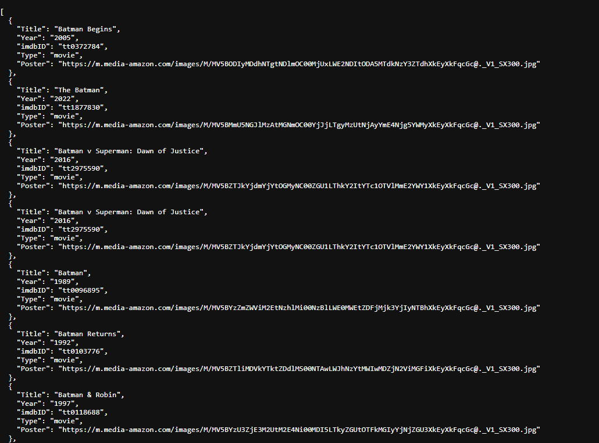

# SBA 12: Build a RESTful Server

[Karl Johnson](https://github.com/hirekarl)  
2025-RTT-30  
<time datetime="2025-08-20">2025-08-20</time>  



## Overview
### Viewer Instructions
1. In the terminal, run:

```bash
cd movie-finder-api && npm i && npm run dev
```

2. Navigate to http://localhost:3001 in the browser.

### Submission Source
Top-level application behavior can be found in [`./movie-finder-api/server.js`](./movie-finder-api/server.js).

### Reflection
> At first, I was unclear on how to split the routing from the controlling, but the module material was really helpful in helping get my head around the separation of concerns.
> 
> I implemented a root route, http://localhost:3001/, that serves user-friendly links to:
> - http://localhost:3001/api/search?title=batman
> - http://localhost:3001/api/movies/tt0372784
>
> In the case of search results, my API returns the results of the `Search` property of the `response.data` object; i.e., the response is an array of movie objects, rather than a single object with a key of `Search`. Both the title search and ID search constrain results to those of type `movie`.

## Assignment
You are a junior backend developer at a new startup creating a movie review website. Your first major task is to build the core of the backend: a “Movie Finder” API. This API will not store any data itself; instead, it will act as an intermediary, fetching movie information from a public, external movie database. Your API will then provide cleaned-up, relevant data to the future front-end application.

This assessment will test your ability to structure a server, handle routes, interact with an external service, and manage configuration securely - all core skills for a backend developer.
